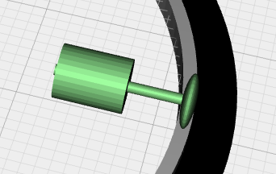
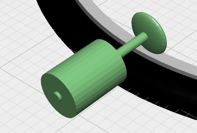

# r-e-cycle
electrical motor system for the bicycle you already have

# Rationale

Why are e-cycle motors so complicated? Why do they require replacing so many part to be mounted?
Why do they interfere with you when you don't want the extra e-help?

Here is a motor that is modern, advanced and reliable - yet dead-simple. Built on common standardized components and can be mounted on virtually any bicycle.

Why haven't you found this yet? Well - here it is.

Or - to be sincere - it doesn't exist yet.

# Design Ideas

The basic motor placement relative to the wheel

Or outside

(3d view http://openjscad.org#https://raw.githubusercontent.com/dagrende/r-e-cycle/master/images/wheelMotorIdea.jscad)
